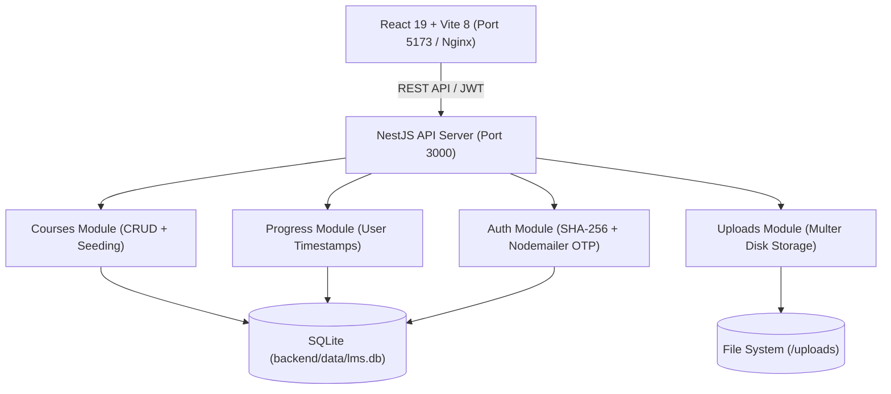

# 🎓 LiteRight Academy — Comprehensive Technical & Architecture Report

**Repository:** [github.com/A-Generative-Slice/literight.git](https://github.com/A-Generative-Slice/literight.git)  
**Local Workspace:** `/sdcard/antigravity/literight`  
**Live Production URL:** [literight.centralindia.cloudapp.azure.com](http://literight.centralindia.cloudapp.azure.com)  
**Local Test Servers:** Frontend: `http://localhost:5173` | Backend: `http://localhost:3000`  

---

## 1. Executive Summary

**LiteRight Academy** is an industry-tailored Learning Management System (LMS) engineered for **Litelab Milano**, an international vanguard in architectural lighting design. The platform is designed to provide high-end, studio-grade lighting education spanning physics, human perception, optics, conceptual hierarchies, and architectural documentation.

The user experience centers around the **"Litelab Royale"** aesthetic — a monochromatic (`#000` / `#FFF`) visual framework featuring glassmorphism, responsive typography, subtle parallax particle simulations, and a 16:9 cinematic video player.

---

## 2. Local Environment Setup & Execution Status

Both the frontend and backend were successfully installed, compiled, and executed locally in the `/sdcard/antigravity/literight` directory:

| Service | Technology | Port | Local Endpoint | Status |
|---|---|---|---|---|
| **Backend** | NestJS 11 + TypeORM + SQLite3 | `3000` | `http://localhost:3000` | **Active & Responding** |
| **Frontend** | React 19 + Vite 8 + Zustand | `5173` | `http://localhost:5173` | **Active & Responding** |

### Environment Engineering Highlight
On Android/Termux environments, `/sdcard` is mounted with the `noexec` flag and lacks symlink capabilities on FAT/sdcardfs. To enable native binaries (`rolldown`, `sqlite3` prebuilt N-API binaries) and `node_modules` symlinks while keeping all repository source code within `/sdcard/antigravity/literight`, ext4 bind-mounts were established for `node_modules`.

### Verified Local Endpoints
- `GET http://localhost:3000/courses` ➔ **HTTP 200** (Delivered 4-module curriculum with 14 lessons).
- `POST http://localhost:3000/auth/login` ➔ **HTTP 201** (Admin login verified, returned JWT Bearer token).
- `GET http://localhost:5173/` ➔ **HTTP 200** (Vite dev server serving React client).

---

## 3. Technology Stack & Architecture



### Frontend Architecture
- **Framework:** React 19 (`react` 19.2.4, `react-dom` 19.2.4)
- **Build Tool:** Vite 8.0.8
- **State Management:** Zustand 5.0.12 with `persist` middleware (`localStorage` sync)
- **Routing:** React Router v7 (`react-router-dom` 7.14.1)
- **Icons:** `lucide-react` + bespoke architectural SVG icon set (`src/components/Icon.jsx`)
- **Styling:** Vanilla CSS design system with CSS custom properties (`--container-px`, glassmorphic tokens)

### Backend Architecture
- **Framework:** NestJS 11 (`@nestjs/core`, `@nestjs/common`, `@nestjs/platform-express`)
- **ORM / Persistence:** TypeORM 0.3.28 with SQLite3 driver (`sqlite3` 5.1.7)
- **Authentication:** Passport JWT (`@nestjs/jwt`, `@nestjs/passport`, `passport-jwt`)
- **Mailing:** Nodemailer 8.0.5 with branded HTML responsive templates
- **Static Assets:** `@nestjs/serve-static` serving `/uploads`

---

## 4. Key Application Modules & Pages

### 1. Public Landing (`src/pages/PublicLanding.jsx`)
- Interactive mouse-tracking parallax hero (`mousePos` normalized coordinate tracking).
- Dynamic particle canvas animation (`ParticleField.jsx`).
- Showcase of Litelab Milano legacy, curriculum highlights, and course catalog.
- Course cards displaying live thumbnails, pricing, ratings, student count, and tags.

### 2. Course Detail & Player (`src/pages/CourseDetail.jsx`)
- 16:9 mathematical aspect ratio video container with custom play controls and branded overlays.
- Syllabus accordion featuring modules, objectives, and individual lessons.
- Built-in quiz player module (`src/components/QuizPlayer.jsx`).
- Premium access gating: non-premium users are gated from accessing modules beyond Module 1.

### 3. Authentication & Recovery (`src/pages/AuthPage.jsx`)
- Dual-mode (Sign Up & Log In) modal with one-click toggles.
- Two-Factor OTP email verification workflow:
  1. Student enters email + password.
  2. System generates a 6-digit cryptographic OTP and dispatches it via Gmail SMTP.
  3. Student enters OTP within 10-minute expiry window to activate session.
- Forgot Password pipeline: Email ➔ OTP ➔ Confirm New Password ➔ Immediate login.
- Built-in Admin bypass credentials (`Admin` / `Admin`) for instant CMS administrative access.

### 4. Student Nexus Profile (`src/pages/ProfilePage.jsx`)
- Monochromatic user dashboard displaying enrolled courses.
- Real-time profile editing (display name and avatar image upload).
- Direct resume links to course lessons.

### 5. Admin CMS Dashboard (`src/pages/AdminPanel.jsx`)
- Course management suite: create new courses, edit existing syllabi, update prices.
- Modular chapter and lesson editor (lesson descriptions, video URLs, durations, source materials).
- Direct file and video uploader using Multer (`/uploads`).

---

## 5. Database Schema & Data Models

The SQLite database (`backend/data/lms.db`) automatically synchronizes five primary entities:

```
┌─────────────────────────────────┐       ┌─────────────────────────────────┐
│              User               │       │             Course              │
├─────────────────────────────────┤       ├─────────────────────────────────┤
│ id (PK)                         │◄──┐   │ id (PK)                         │
│ username (unique)               │   └───┼ title                           │
│ passwordHash                    │   M:N ┼ instructor                      │
│ role ('student' | 'admin')      │       │ price / originalPrice           │
│ isVerified (boolean)            │       │ thumbnail / trailer             │
│ isPremium (boolean)             │       │ passPercentage                  │
│ otpCode / otpExpiry             │       │ tags (simple-array)             │
└─────────────────────────────────┘       └────────────────┬────────────────┘
                                                           │ 1:N
                                          ┌────────────────▼────────────────┐
┌─────────────────────────────────┐       │             Chapter             │
│            Progress             │       ├─────────────────────────────────┤
├─────────────────────────────────┤       │ id (PK)                         │
│ id (PK)                         │       │ title / objective               │
│ userId                          │       │ courseId (FK)                   │
│ lessonId                        │       └────────────────┬────────────────┘
│ timestamp (float)               │                        │ 1:N
│ completed (boolean)             │       ┌────────────────▼────────────────┐
│ updatedAt                       │       │             Lesson              │
└─────────────────────────────────┘       ├─────────────────────────────────┤
                                          │ id (PK)                         │
                                          │ title / duration                │
                                          │ description / videoUrl          │
                                          │ sourceMaterial                  │
                                          │ chapterId (FK)                  │
                                          └─────────────────────────────────┘
```

---

## 6. Cloud Deployment Architecture

The repository includes preconfigured scripts for deployment to Azure:
- **Server:** Azure Virtual Machine (Ubuntu 22.04 LTS, Central India region).
- **Reverse Proxy:** Nginx proxying port 80 to `dist/` and `/api/` to `localhost:3000`.
- **Process Manager:** PM2 managing `lms-backend`.
- **LBRD Pipeline (`sync_to_azure.sh`):**
  1. Pre-compiles frontend locally (`npm run build`) to prevent remote server Out-Of-Memory (OOM) failures.
  2. Archives `dist/` into `dist.tar.gz`.
  3. Securely copies the archive to Azure via `scp` using SSH key `.keys/azure_deploy_key`.
  4. Atomically replaces remote `dist/` and triggers `pm2 restart lms-backend`.

---

## 7. Security & Engineering Recommendations

1. **Password Hashing Upgrade**: Currently, passwords are plain SHA-256 hashed without unique salt (`crypto.createHash('sha256').update(password).digest('hex')`). Recommended to upgrade to `bcrypt` or `argon2` to protect against rainbow table attacks.
2. **Environment Variable Decoupling**: In `backend/src/auth/email.service.ts`, fallback Gmail SMTP credentials (`s.m.d.hussainjoe@gmail.com` and app password) are committed in plain text. Move these strictly into a `.env` file excluded by `.gitignore`.
3. **Admin Authentication Hardening**: The hardcoded fallback credentials (`Admin` / `Admin`) in `auth.service.ts` should be disabled or protected by an environment flag in production.
4. **JWT Expiration & Refresh Tokens**: Tokens currently have a standard lifespan without rotating refresh tokens. Implementing refresh token rotation will enhance session security.
